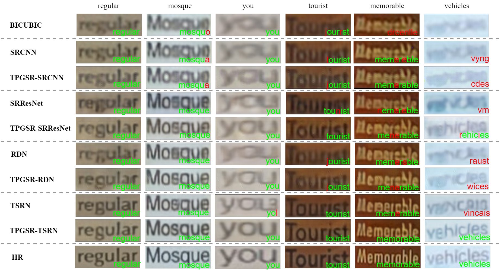
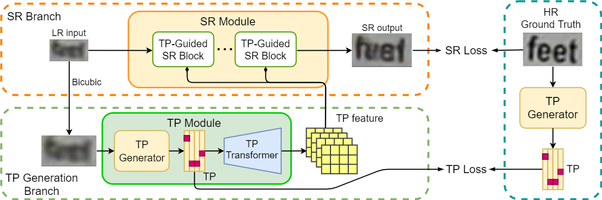
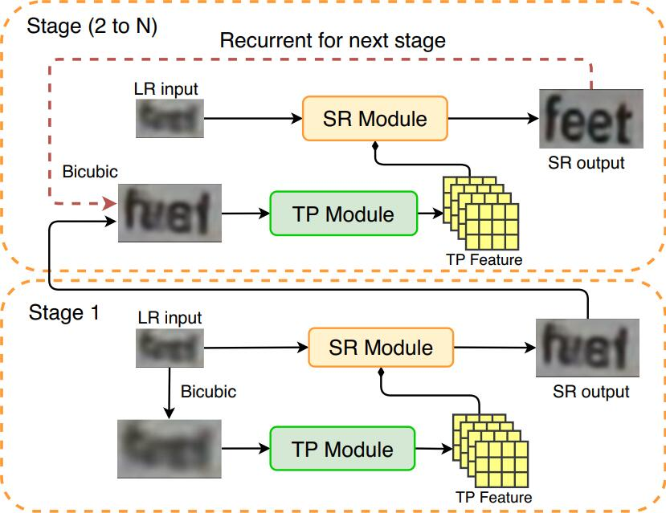

# Text Prior Guided Scene Text Image Super-Resolution
https://arxiv.org/abs/2106.15368

_Jianqi Ma, Shi Guo, [Lei Zhang](https://www4.comp.polyu.edu.hk/~cslzhang)_  
_Department of Computing, [The Hong Kong Polytechnic University](http://www.comp.polyu.edu.hk), Hong Kong, China_

#### Recovering TextZoom samples


## Environment:


```
Other possible python packages like pyyaml, cv2, Pillow and imgaug
```

## Main idea
### Single stage with loss
 

### Multi-stage version
 

## Configure your training
### Download the pretrained recognizer from: 

	Aster: https://github.com/ayumiymk/aster.pytorch  
	MORAN:  https://github.com/Canjie-Luo/MORAN_v2  
	CRNN: https://github.com/meijieru/crnn.pytorch

Unzip the codes and walk into the '$TPGSR_ROOT$/', place the pretrained weights from recognizer in '$TPGSR_ROOT$/'.

### Download the TextZoom dataset:

	https://github.com/JasonBoy1/TextZoom

### Train the corresponding model (e.g. TPGSR-TSRN):
```
chmod a+x train_TPGSR-TSRN.sh
./train_TPGSR-TSRN.sh
```

### Run the test-prefixed shell to test the corresponding model.
```
Adding '--go_test' in the shell file
```
## Cite this paper:

	@article{ma2021text,
  	title={Text Prior Guided Scene Text Image Super-resolution},
  	author={Ma, Jianqi and Guo, Shi and Zhang, Lei},
  	journal={arXiv preprint arXiv:2106.15368},
  	year={2021}
	}

